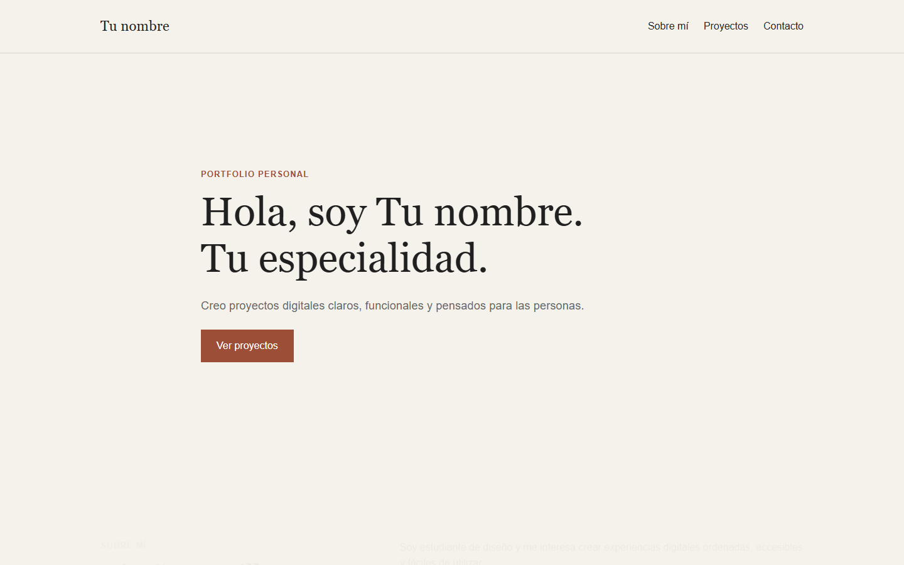

# Portfolio personal

Portfolio de diseño web con una selección de proyectos académicos realizados durante la asignatura. El sitio incluye una presentación personal, una galería dinámica, filtros por categoría y seis casos de estudio.

## Sitio publicado

[https://iratxewenshu.github.io/portfolio_final/](https://iratxewenshu.github.io/portfolio_final/)

## Tecnologías

- HTML5
- CSS3
- Flexbox y Grid
- JavaScript
- Git y GitHub Pages

## Proyectos

- Harry Beck
- Minimalismo: menos es más
- La Velada del Año VI
- Ibili Home
- Ibili Catálogo
- AURA Pilates Studio

## Captura

## Personalización pendiente

Los textos `Tu nombre`, `Tu especialidad`, `tuemail@ejemplo.com` y los enlaces de redes sociales deben sustituirse por los datos personales definitivos antes de utilizar el portfolio profesionalmente.

## Declaración de uso de inteligencia artificial

Se ha utilizado OpenAI Codex como apoyo para organizar la estructura del proyecto, redactar el código HTML, CSS y JavaScript, preparar los casos de estudio y revisar el cumplimiento de los requisitos técnicos. El contenido parte de los proyectos académicos existentes.
